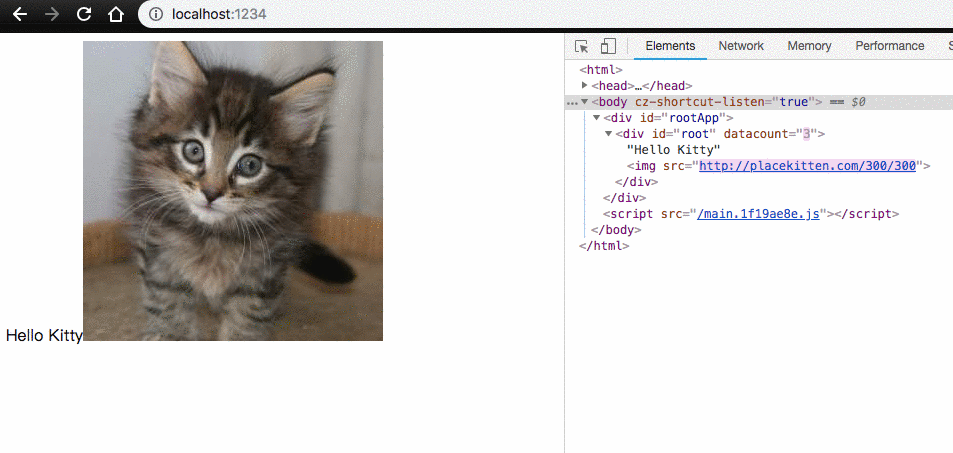

# Practice for Virtual DOM

Learned from [Jason Yu](http://twitter.com/ycmjason)，this is for documenting my learning.

[codesandbox](https://codesandbox.io/s/434xr5mr84)

Ref:
1. https://github.com/ycmjason-talks/2018-11-21-manc-web-meetup-4
2. https://dev.to/ycmjason/building-a-simple-virtual-dom-from-scratch-3d05#mount-node-target

## To run

```
> npm install
> npm run dev
```

## Demo

